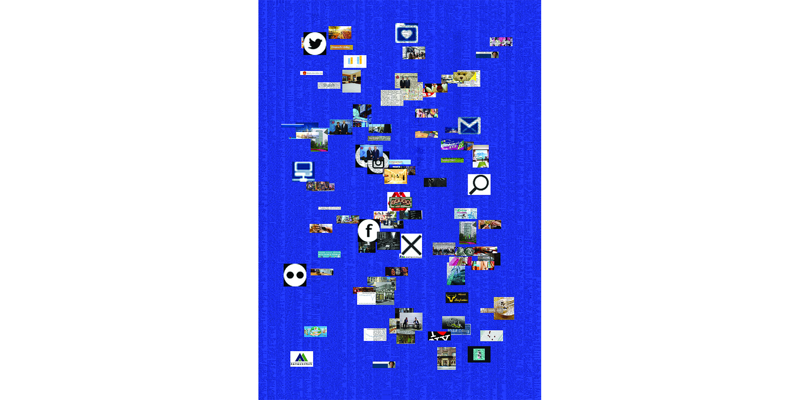
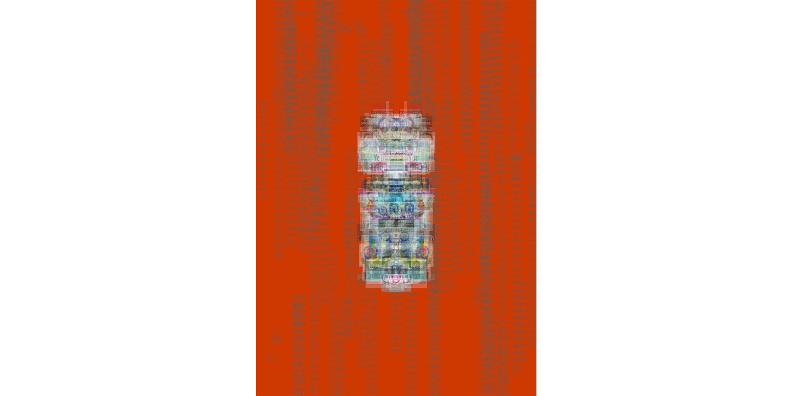

# psychic


```
python psychic.py -i sniffa
```



```
python psychic.py -i sniffa -f html css jpg --background-color 30 50 230 -tw 15 --html-resolve --text-crop 2000 5000 -g random
```



```
python psychic.py -i sniffa -t random -tw 20 --text-crop 2000 5000 -tc 100 -bc 200 90 40 --graphic-layer-margin 40 -gt 50
```
